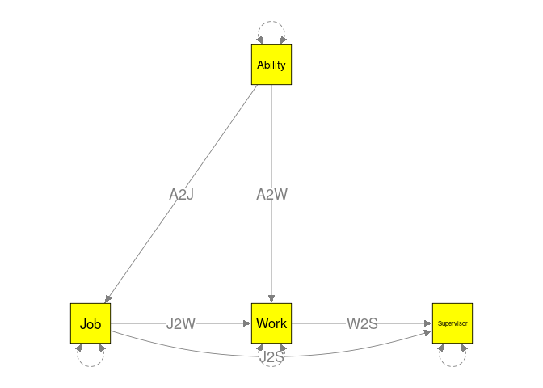
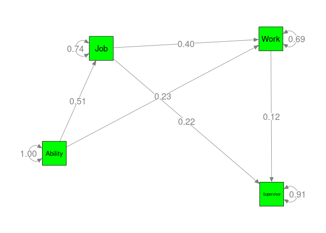

# Read data

``` r
library(metaSEM)
library(readxl)

## Sheets with correlation matrices
sheets <- as.character(1:14)

## An empty list to store the correlation matrices
my.R <- list()
for (i in sheets) {
  my.R[[i]] <- read_excel("Hunter83.xlsx", sheet=i)
}

## Convert it to correlation matrices with proper dimension names
my.R <- lapply(my.R, function(x) {x <- unlist(x)
                                  x <- matrix(x, ncol=4)
                                  x <- vechs(x)
                                  vec2symMat(x, diag=FALSE)})

## Variables used in the analysis
var.names <- c("Ability", "Job", "Work", "Supervisor")

## Add the dimensions to the correlation matrices
my.R <- lapply(my.R, function(x) { dimnames(x) <- list(var.names, var.names); x})

## Read study names and sample sizes in sheet "0"
my.study <- read_excel("Hunter83.xlsx", sheet="0")
names(my.R) <- my.study$Study

## Sample sizes
n <- my.study$n
n
```

```
##  [1] 443 186 292 233 368 360 380 366 456  78 384  59 160 210
```

``` r
## Show the first two studies
my.R[1:2]
```

```
## $`Campbell et al. (1973)`
##            Ability  Job Work Supervisor
## Ability       1.00 0.65 0.48       0.33
## Job           0.65 1.00 0.52       0.40
## Work          0.48 0.52 1.00       0.23
## Supervisor    0.33 0.40 0.23       1.00
## 
## $`Corts et al. (1977)`
##            Ability  Job Work Supervisor
## Ability       1.00 0.53 0.50       0.03
## Job           0.53 1.00 0.49       0.04
## Work          0.50 0.49 1.00       0.18
## Supervisor    0.03 0.04 0.18       1.00
```

``` r
## Number of studies per bivariate relation
pattern.na(my.R, show.na=FALSE)
```

```
##            Ability Job Work Supervisor
## Ability         14  11   11         12
## Job             11  14   10         11
## Work            11  10   14         11
## Supervisor      12  11   11         14
```

``` r
## Total sample size per bivariate relation
pattern.n(my.R, n)
```

```
##            Ability  Job Work Supervisor
## Ability       3975 3372 3281       3605
## Job           3372 3975 2998       3322
## Work          3281 2998 3975       3231
## Supervisor    3605 3322 3231       3975
```

# Stage 1 analysis: Random-effects model

``` r
random1 <- tssem1(my.R, n, method="REM", RE.type="Diag")

summary(random1)
```

```
## 
## Call:
## meta(y = ES, v = acovR, RE.constraints = Diag(paste0(RE.startvalues, 
##     "*Tau2_", 1:no.es, "_", 1:no.es)), RE.lbound = RE.lbound, 
##     I2 = I2, model.name = model.name, suppressWarnings = TRUE, 
##     silent = silent, run = run)
## 
## 95% confidence intervals: z statistic approximation (robust=FALSE)
## Coefficients:
##               Estimate   Std.Error      lbound      ubound z value  Pr(>|z|)
## Intercept1  5.0034e-01  2.8129e-02  4.4521e-01  5.5547e-01 17.7876 < 2.2e-16
## Intercept2  4.3195e-01  2.1678e-02  3.8946e-01  4.7443e-01 19.9256 < 2.2e-16
## Intercept3  2.0627e-01  2.5372e-02  1.5654e-01  2.5600e-01  8.1296 4.441e-16
## Intercept4  5.2111e-01  3.2023e-02  4.5835e-01  5.8387e-01 16.2732 < 2.2e-16
## Intercept5  2.5663e-01  3.6546e-02  1.8500e-01  3.2826e-01  7.0221 2.185e-12
## Intercept6  2.3514e-01  1.7114e-02  2.0160e-01  2.6869e-01 13.7397 < 2.2e-16
## Tau2_1_1    6.5670e-03  3.6664e-03 -6.1900e-04  1.3753e-02  1.7911   0.07327
## Tau2_2_2    2.5928e-03  2.2078e-03 -1.7344e-03  6.9200e-03  1.1744   0.24025
## Tau2_3_3    4.2403e-03  2.8670e-03 -1.3789e-03  9.8595e-03  1.4790   0.13914
## Tau2_4_4    8.3326e-03  4.6827e-03 -8.4538e-04  1.7511e-02  1.7794   0.07517
## Tau2_5_5    1.1414e-02  6.1970e-03 -7.3162e-04  2.3560e-02  1.8419   0.06549
## Tau2_6_6    1.0000e-10  1.4487e-03 -2.8394e-03  2.8394e-03  0.0000   1.00000
##               
## Intercept1 ***
## Intercept2 ***
## Intercept3 ***
## Intercept4 ***
## Intercept5 ***
## Intercept6 ***
## Tau2_1_1   .  
## Tau2_2_2      
## Tau2_3_3      
## Tau2_4_4   .  
## Tau2_5_5   .  
## Tau2_6_6      
## ---
## Signif. codes:  0 '***' 0.001 '**' 0.01 '*' 0.05 '.' 0.1 ' ' 1
## 
## Q statistic on the homogeneity of effect sizes: 244.9086
## Degrees of freedom of the Q statistic: 60
## P value of the Q statistic: 0
## 
## Heterogeneity indices (based on the estimated Tau2):
##                              Estimate
## Intercept1: I2 (Q statistic)   0.7636
## Intercept2: I2 (Q statistic)   0.5198
## Intercept3: I2 (Q statistic)   0.5638
## Intercept4: I2 (Q statistic)   0.8126
## Intercept5: I2 (Q statistic)   0.7886
## Intercept6: I2 (Q statistic)   0.0000
## 
## Number of studies (or clusters): 14
## Number of observed statistics: 66
## Number of estimated parameters: 12
## Degrees of freedom: 54
## -2 log likelihood: -130.3261 
## OpenMx status1: 0 ("0" or "1": The optimization is considered fine.
## Other values may indicate problems.)
```

# Stage 2 analysis: Random-effects model

``` r
model <- "Job ~ A2J*Ability
          Work ~ A2W*Ability + J2W*Job
          Supervisor ~ J2S*Job + W2S*Work

          ## Fix the variance of Ability at 1
          Ability ~~ 1*Ability
          
          ## Indirect effect from Ability to Supervisor
          indirect := A2W*W2S + A2J*J2W*W2S
"

plot(model, color="yellow")
```

<!-- -->

``` r
RAM <- lavaan2RAM(model, obs.variables=c("Ability","Job", "Work","Supervisor"))
RAM
```

```
## $A
##            Ability   Job       Work      Supervisor
## Ability    "0"       "0"       "0"       "0"       
## Job        "0.1*A2J" "0"       "0"       "0"       
## Work       "0.1*A2W" "0.1*J2W" "0"       "0"       
## Supervisor "0"       "0.1*J2S" "0.1*W2S" "0"       
## 
## $S
##            Ability Job              Work              
## Ability    "1"     "0"              "0"               
## Job        "0"     "0.5*JobWITHJob" "0"               
## Work       "0"     "0"              "0.5*WorkWITHWork"
## Supervisor "0"     "0"              "0"               
##            Supervisor                    
## Ability    "0"                           
## Job        "0"                           
## Work       "0"                           
## Supervisor "0.5*SupervisorWITHSupervisor"
## 
## $F
##            Ability Job Work Supervisor
## Ability          1   0    0          0
## Job              0   1    0          0
## Work             0   0    1          0
## Supervisor       0   0    0          1
## 
## $M
##   Ability Job Work Supervisor
## 1       0   0    0          0
## 
## $mxalgebras
## $mxalgebras$indirect
## mxAlgebra 'indirect' 
## $formula:  A2W * W2S + A2J * J2W * W2S 
## $result: (not yet computed) <0 x 0 matrix>
## dimnames: NULL
```

``` r
## intervals.type="LB": likelihood-based CIs
random2 <- tssem2(random1, RAM=RAM, intervals.type="LB")
summary(random2)
```

```
## 
## Call:
## wls(Cov = pooledS, aCov = aCov, n = tssem1.obj$total.n, RAM = RAM, 
##     Amatrix = Amatrix, Smatrix = Smatrix, Fmatrix = Fmatrix, 
##     diag.constraints = diag.constraints, cor.analysis = cor.analysis, 
##     intervals.type = intervals.type, mx.algebras = mx.algebras, 
##     mxModel.Args = mxModel.Args, subset.variables = subset.variables, 
##     model.name = model.name, suppressWarnings = suppressWarnings, 
##     silent = silent, run = run)
## 
## 95% confidence intervals: Likelihood-based statistic
## Coefficients:
##     Estimate Std.Error   lbound   ubound z value Pr(>|z|)
## A2J 0.510862        NA 0.456868 0.564816      NA       NA
## J2S 0.224791        NA 0.137924 0.312325      NA       NA
## W2S 0.120746        NA 0.058181 0.179446      NA       NA
## A2W 0.232159        NA 0.158245 0.301602      NA       NA
## J2W 0.396785        NA 0.309103 0.485046      NA       NA
## 
## mxAlgebras objects (and their 95% likelihood-based CIs):
##                   lbound Estimate     ubound
## indirect[1,1] 0.02505965 0.052508 0.07991216
## 
## Goodness-of-fit indices:
##                                                Value
## Sample size                                3975.0000
## Chi-square of target model                    3.7530
## DF of target model                            1.0000
## p value of target model                       0.0527
## Number of constraints imposed on "Smatrix"    0.0000
## DF manually adjusted                          0.0000
## Chi-square of independence model            973.1221
## DF of independence model                      6.0000
## RMSEA                                         0.0263
## RMSEA lower 95% CI                            0.0000
## RMSEA upper 95% CI                            0.0568
## SRMR                                          0.0208
## TLI                                           0.9829
## CFI                                           0.9972
## AIC                                           1.7530
## BIC                                          -4.5348
## OpenMx status1: 0 ("0" or "1": The optimization is considered fine.
## Other values indicate problems.)
```

``` r
plot(random2, color="green", layout="spring")
```

<!-- -->
